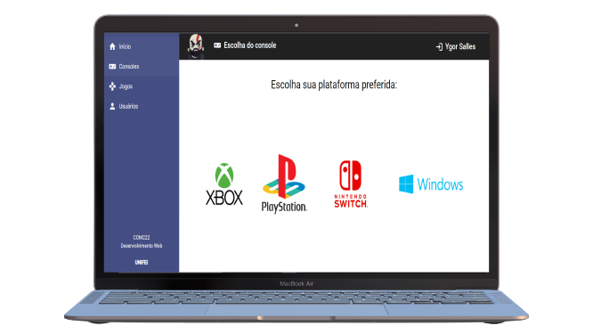

<h4 align="center">
    :computer: Sistema colaborativo para cadastro de games, consoles e hates de games.
</h4>

    <a href="#-projeto">Projeto</a>&nbsp;&nbsp;&nbsp;|&nbsp;&nbsp;&nbsp;
    <a href="#rocket-tecnologias">Tecnologias</a>&nbsp;&nbsp;&nbsp;|&nbsp;&nbsp;&nbsp;
    <a href="#user-content-clipboard-instruções">Instruções</a>&nbsp;&nbsp;&nbsp;|&nbsp;&nbsp;&nbsp;
    <a href="#-ajustes-e-melhorias">Melhorias</a>

 

## 💻 Projeto

Frontend App em Angular. Aplicação frontend para cadastro de games, consoles e hates de games. Onde após feito o cadastro do usuário é possível colaborar no cadastro de novos games, realizar comentários e dar avaliações sobre os games.

 

## :rocket: Tecnologias

- [Angular](https://angular.io/) 
- [Material](https://material.angular.io/)
- [Typescript](https://www.typescriptlang.org/)
- [HTML5](https://developer.mozilla.org/pt-BR/docs/Web/Guide/HTML/HTML5)
- [CSS3](https://developer.mozilla.org/pt-BR/docs/Web/CSS)

## :clipboard: Instruções

----
### INTERFACE - FRONTEND

- Execute `$ yarn` para instalar todas as dependencias.
- Após todas as dependencias serem instaladas e as variáveis serem preenchidas, basta executar  `yarn start` para iniciar a interface frontend.

----
## 📌 Ajustes e melhorias

O projeto ainda está em desenvolvimento e as próximas atualizações serão voltadas nas seguintes tarefas:

- [ ] Inserir loading nas telas 
- [ ] Melhorar exibição da tabela de jogos
- [ ] Validar cálculo da média de avaliações
- [ ] Inserir paginação na tabela de jogos
